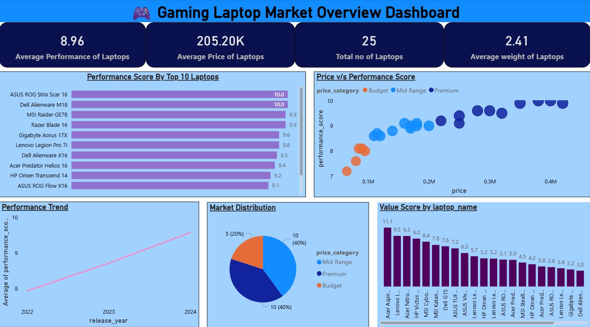
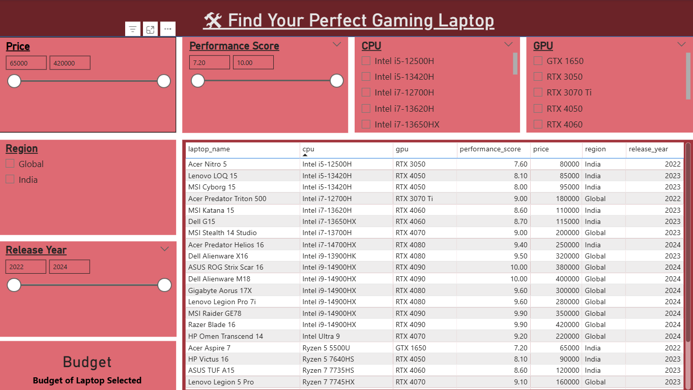
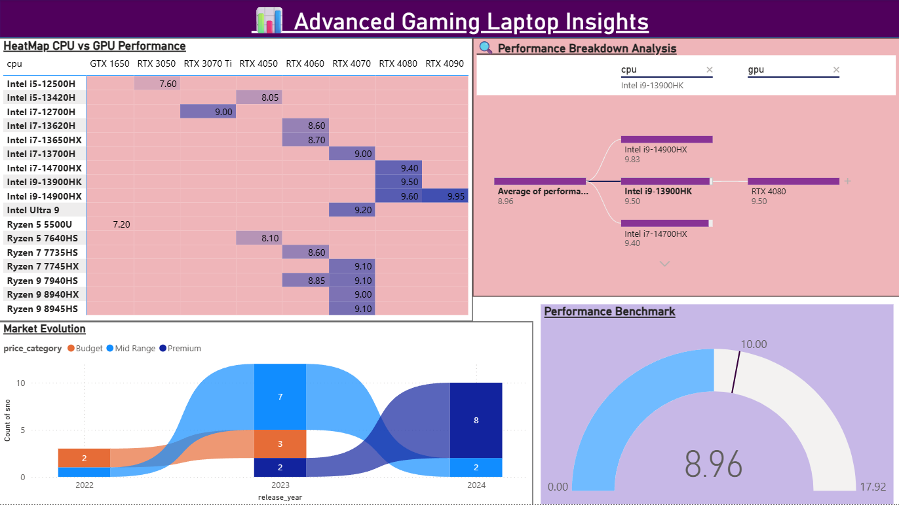

# 🎮 Gaming Laptop Market Analysis (Power BI)

## 📊 Project Overview

This project provides an in-depth analysis of the gaming laptop market using **Power BI**. It explores performance trends, pricing strategies, hardware impact, and market distribution to help users identify the best gaming laptops based on their needs.

---

## 🚀 Key Features

### 🔹 Dashboard 1: Market Overview

* Average performance, price, and weight KPIs
* Performance score comparison of top laptops
* Price vs Performance scatter analysis
* Market distribution by price category
* Value score analysis
* Performance trend over years

---

### 🔹 Dashboard 2: Laptop Finder (Interactive)

* Dynamic filters:

  * Price range
  * Performance score
  * CPU & GPU selection
  * Region & Release year
* Interactive table to explore laptops
* Helps users find the **best laptop based on preferences**

---

### 🔹 Dashboard 3: Advanced Insights

* CPU vs GPU performance heatmap
* Performance breakdown analysis
* Market evolution trends
* Performance benchmarking gauge

---

## 🛠️ Tools & Technologies

* Power BI
* Data Modeling
* DAX (Data Analysis Expressions)
* Data Visualization Techniques

---

## 📈 Key Insights

* High-end GPUs (RTX 4080/4090) dominate top performance scores
* Premium laptops show strong price-performance correlation
* Market trends indicate steady performance improvement over years
* Mid-range laptops offer best value for money

---

## 📂 Files Included

* `gaming_laptop.pbix` → Power BI dashboard file
* Dashboard screenshots for preview

---

## 💡 Use Cases

* Helps users choose gaming laptops based on budget & performance
* Useful for market analysis and product comparison
* Demonstrates real-world data visualization skills

---

## 👨‍💻 Author

**Neeraj Rajeev**
B.Tech Computer Science | Aspiring Data Analyst

---

## ⭐ If you found this useful, consider giving it a star!
